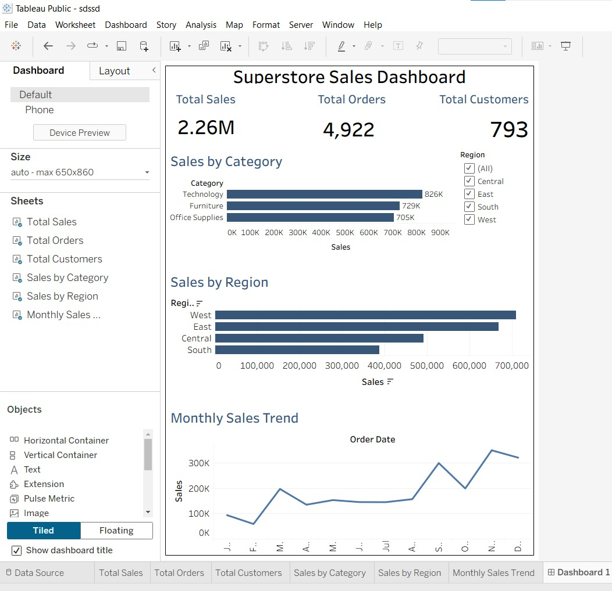

# 📊 Superstore Sales Analysis

## 🚀 DEPI Final Project

This project analyzes retail sales data from a Superstore dataset to transform raw business data into actionable insights that support data-driven decision-making.

The project was completed using Python for data analysis and Tableau for data visualization.

---

## 📌 Project Overview

Businesses generate large amounts of data every day, but raw data alone does not provide value.

The objective of this project is to analyze sales data, identify key business patterns, discover performance trends, and provide recommendations based on data insights.

Through this analysis, we answer important business questions related to:

- Sales Performance
- Product Categories
- Regional Performance
- Customer Behavior
- Product Performance
- Monthly Sales Trends

---

## 🎯 Business Questions

1. Which category has the highest sales?
2. Which region performs best?
3. Who are the top customers?
4. Which products generate the highest sales?
5. How do sales change over time?

---

## 📂 Dataset Overview

| Metric | Value |
|---------|---------|
| Records | 9,800 |
| Columns | 18 |
| Customers | 793 |
| Orders | 4,922 |
| Categories | 3 |
| Regions | 4 |
| Period | Jan 2015 – Dec 2018 |

---

## 🛠 Technologies Used

- Python
- Pandas
- NumPy
- Matplotlib
- Jupyter Notebook
- Tableau
- GitHub

---

## 🔄 Data Preparation

The following steps were performed before analysis:

- Missing Values Check
- Duplicate Check
- Order Date Conversion
- Data Type Verification
- Data Cleaning

Workflow:

Raw Dataset
↓
Missing Values Check
↓
Duplicate Check
↓
Date Conversion
↓
Data Type Verification
↓
Ready for Analysis

---

## 📈 Exploratory Data Analysis (EDA)

The analysis focused on:

- Sales Analysis
- Category Analysis
- Region Analysis
- Customer Analysis
- Product Analysis
- Monthly Sales Trend Analysis

---

## 📊 Key Findings

### Best Performing Category

Technology generated the highest sales among all product categories.

### Best Performing Region

West Region achieved the highest sales performance.

### Top Customer

Sean Miller generated the highest sales among customers.

### Top Product

Canon imageCLASS 2200 Advanced Copier achieved the highest sales among products.

### Monthly Sales Trend

Sales fluctuated over time, highlighting seasonal variations and changing business performance.

---

## 📉 Tableau Dashboard

The Tableau dashboard was created to provide an interactive view of:

- Total Sales
- Total Orders
- Total Customers
- Sales by Category
- Sales by Region
- Top Customers
- Top Products
- Monthly Sales Trend

### Dashboard Preview


---

## 💡 Business Recommendations

- Focus on high-performing Technology products.
- Replicate successful strategies from the West Region.
- Retain high-value customers through loyalty programs.
- Use interactive dashboards for continuous performance monitoring.

---

## 📁 Project Structure

```text
Superstore-Sales-Analysis
│
├── README.md
├── Superstore_Sales_Analysis.ipynb
├── Superstore.csv
├── requirements.txt
├── Dashboard.twbx
├── Dashboard.png
├── DEPI_Final_Presentation.pptx
│
└── images
      └── dashboard.png
```

---

## 👥 Team Members

- Omar Hossam
- Ahmed Soliman
- Anas Abdeldaym
- Mohamed Ali
- Farouk Farrag

---

## 🎓 DEPI Final Project

Digital Egypt Pioneers Initiative (DEPI)

This project demonstrates how data analysis transforms raw business data into actionable business decisions.
